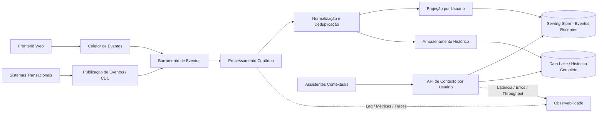

## Titulo: Arquitetura de Ingestão e Consulta de Eventos para Assistentes Contextuais

**Nivel:** AVANCADO  
**Temas:** Event-Driven Architecture, Data Streaming, Event Sourcing, Serving Layer, Big Data, Baixa Latência, Ordenação de Eventos, Deduplicação, Consistência Eventual, Jornada do Usuário, Chatbots Contextuais

## Resumo do Problema:

Uma plataforma digital deseja utilizar assistentes conversacionais para apoiar usuários ao longo de uma jornada complexa, desde a navegação inicial até a conclusão de ações transacionais importantes. Esses assistentes devem responder dúvidas, recuperar contexto recente e também atuar de forma proativa com base no histórico de interações do usuário.

Para viabilizar esse comportamento, é necessário construir uma arquitetura capaz de integrar eventos de navegação gerados pela interface web com dados transacionais provenientes de sistemas internos. Esses dados representam ações como início de fluxos, agendamentos, propostas, confirmações, cancelamentos e conclusão de etapas críticas.

O principal desafio é disponibilizar, de forma contínua, uma visão atualizada da jornada do usuário. Por exemplo, o sistema deve identificar quando um usuário inicia uma ação importante, mas não a conclui, permitindo que o assistente atue de maneira contextual e sugira a continuidade do processo.

Os assistentes consomem esses dados através de uma API simples baseada em consultas por identificador de usuário, retornando eventos brutos associados à jornada. Essa API deve responder em milissegundos, enquanto novos eventos precisam estar disponíveis para consulta dentro de uma janela curta após sua geração.

O sistema deve suportar milhões de usuários distintos por mês, acesso a interações recentes e consulta ao histórico completo. O escopo envolve ingestão de múltiplas fontes, processamento contínuo, armazenamento histórico em larga escala e uma camada de serving eficiente, equilibrando latência, consistência, custo operacional e capacidade de reprocessamento.

---

## Requisitos Funcionais

- Ingerir eventos de navegação gerados pelo front-end.
- Ingerir dados transacionais de sistemas internos.
- Processar eventos de múltiplas fontes de forma contínua.
- Armazenar histórico completo de eventos por usuário.
- Disponibilizar eventos recentes para consulta em até 30 segundos após sua geração.
- Expor uma API de consulta por identificador de usuário.
- Retornar eventos brutos ordenados por tempo.
- Suportar consulta dos últimos N eventos de um usuário.
- Suportar consulta do histórico completo com paginação.
- Permitir reconstrução da jornada completa do usuário.
- Identificar ações iniciadas e não concluídas.
- Evitar duplicidade de eventos.
- Garantir ordenação temporal consistente por usuário.
- Permitir reprocessamento de dados históricos.
- Suportar evolução do esquema dos eventos ao longo do tempo.

---

## Requisitos Não Funcionais

- Suportar ingestão contínua em alta escala.
- Processar aproximadamente milhares de eventos por segundo.
- Suportar dezenas de milhões de usuários distintos por mês.
- Armazenar bilhões de eventos mensais.
- Gerenciar crescimento mensal na ordem de múltiplos terabytes.
- Garantir latência p95 inferior a 200 ms na API de consulta.
- Suportar pelo menos centenas de requisições por segundo na camada de serving.
- Garantir disponibilidade elevada da API e dos pipelines de ingestão.
- Garantir durabilidade dos eventos persistidos.
- Garantir consistência temporal por usuário.
- Disponibilizar dados recentes dentro da janela máxima de 30 segundos.
- Evitar stale reads dentro da janela operacional definida.
- Permitir escalabilidade horizontal dos componentes de ingestão, processamento e serving.
- Lidar com variações sazonais de carga.
- Controlar custo operacional de armazenamento e consulta.
- Garantir observabilidade ponta a ponta do pipeline.

---

## Detalhes e Pistas de Implementação

- Separar a arquitetura em camadas de ingestão, processamento, armazenamento histórico e serving.
- Utilizar um barramento de eventos para desacoplar produtores e consumidores.
- Particionar eventos por identificador de usuário para preservar ordenação relativa.
- Utilizar chaves de idempotência para deduplicação.
- Separar armazenamento quente para eventos recentes e armazenamento frio para histórico completo.
- Considerar um banco orientado a chave/coluna para consultas rápidas por usuário.
- Considerar um data lake ou object storage para retenção histórica de baixo custo.
- Implementar compactação, particionamento temporal e políticas de ciclo de vida para dados históricos.
- Utilizar CDC ou publicação de eventos de domínio para integrar dados transacionais.
- Implementar schema registry ou contratos versionados para evolução dos eventos.
- Utilizar consumidores stream processing para normalização, enriquecimento e ordenação.
- Manter projeções materializadas por usuário para otimizar consultas dos últimos eventos.
- Implementar paginação baseada em cursor para consulta do histórico completo.
- Criar mecanismos de reconciliação para corrigir divergências entre fontes.
- Implementar monitoramento de lag do pipeline para garantir a janela de 30 segundos.
- Usar correlation IDs e tracing distribuído para rastrear eventos ponta a ponta.
- Avaliar trade-offs entre consistência forte por usuário e custo/latência da camada de serving.
- Implementar reprocessamento histórico a partir do armazenamento bruto de eventos.

---

## Extensões / Perguntas de Reflexão (Opcional)

- Como garantir ordenação temporal por usuário em um pipeline distribuído?
- Como evitar duplicidade quando eventos vêm de múltiplas fontes?
- Como modelar a camada de serving para retornar os últimos eventos em menos de 200 ms?
- Como equilibrar armazenamento quente e frio sem prejudicar a experiência do chatbot?
- Como garantir que novos eventos estejam disponíveis em até 30 segundos?
- Como lidar com eventos atrasados, fora de ordem ou reprocessados?
- Como consultar histórico completo sem degradar a API de eventos recentes?
- Como permitir evolução de schema sem quebrar consumidores?
- Como detectar ações iniciadas e não concluídas a partir de eventos brutos?
- O sistema deve entregar eventos brutos, projeções materializadas ou ambos?
- Como controlar custo operacional em um volume de bilhões de eventos por mês?
- Como reprocessar histórico sem interromper a camada de serving?

---

## Diagrama Conceitual (Mermaid)

