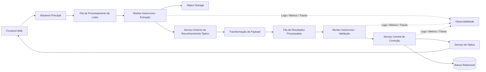

## Titulo: Pipeline Distribuído de Processamento Assíncrono de Formulários Escaneados

**Nivel:** AVANCADO  
**Temas:** Processamento Assíncrono, Event-Driven Architecture, Filas de Mensageria, Serverless, Consistência Eventual, Idempotência, Observabilidade, Integração com Serviços Externos, Processamento de Imagens, Resiliência Distribuída

## Resumo do Problema:

Uma plataforma web permite o envio de arquivos compactados contendo imagens digitalizadas de formulários preenchidos manualmente. Após o upload, o sistema inicia um pipeline assíncrono responsável por extrair, armazenar, interpretar e corrigir os dados contidos nas imagens.

O fluxo é composto por múltiplos componentes distribuídos que se comunicam por eventos e filas de mensageria. Uma primeira camada de processamento realiza a extração das imagens e integra com um serviço externo de reconhecimento óptico responsável por identificar marcações presentes nos formulários.

Os resultados retornados pelo serviço externo são transformados para um modelo interno padronizado e encaminhados para uma segunda etapa de validação e normalização. Posteriormente, os dados são enviados para um serviço central responsável por aplicar regras de negócio, validar respostas esperadas e persistir os resultados em um banco de dados relacional.

Durante o processamento, a interface do usuário acompanha o progresso em tempo real por meio de eventos de status emitidos pelo pipeline distribuído.

O sistema enfrenta desafios relacionados a:

- inconsistências no reconhecimento óptico das imagens;
- duplicidade ou desordem de eventos distribuídos;
- divergência entre estados exibidos ao usuário e o estado real do processamento;
- necessidade de reprocessamento parcial de etapas com falha;
- garantia de rastreabilidade ponta a ponta em fluxos assíncronos.

---

## Requisitos Funcionais

- Receber uploads de arquivos compactados contendo múltiplas imagens.
- Processar lotes de forma assíncrona.
- Extrair imagens e armazená-las em armazenamento de objetos.
- Integrar com serviço externo de reconhecimento óptico.
- Transformar payloads entre diferentes domínios internos.
- Validar e normalizar os dados processados.
- Comparar os resultados processados com um conjunto de respostas esperadas.
- Persistir resultados e metadados do processamento.
- Atualizar o progresso do processamento em tempo real para o usuário.
- Permitir reprocessamento de itens com falha parcial.
- Registrar erros técnicos e erros funcionais do pipeline.
- Disponibilizar rastreabilidade do fluxo completo de processamento.

---

## Requisitos Não Funcionais

- Escalabilidade horizontal do pipeline distribuído.
- Processamento paralelo de grandes volumes de imagens.
- Comunicação desacoplada baseada em eventos.
- Tolerância a falhas entre etapas do fluxo.
- Garantia de idempotência no consumo de mensagens.
- Consistência eventual entre os componentes.
- SLA mínimo de disponibilidade de 99,9%.
- Baixa latência na atualização de status para o front-end.
- Observabilidade completa com logs, métricas e traces distribuídos.
- Rastreabilidade ponta a ponta utilizando correlation IDs.
- Segurança no armazenamento e transporte de arquivos.
- Capacidade de retry e dead-letter queues para falhas permanentes.
- Controle de backpressure no consumo das filas.

---

## Detalhes e Pistas de Implementação

- Utilizar filas independentes para cada etapa do pipeline.
- Implementar contratos de eventos versionados.
- Adotar correlation IDs propagados entre todos os serviços.
- Considerar o uso de workflows distribuídos ou máquinas de estado para rastrear o progresso dos lotes.
- Implementar deduplicação de mensagens para evitar persistência duplicada.
- Garantir ordenação lógica das respostas antes da persistência.
- Utilizar armazenamento temporário para artefatos intermediários.
- Separar erros transitórios de erros permanentes.
- Implementar políticas de retry exponencial com jitter.
- Utilizar DLQ (Dead Letter Queue) para mensagens inválidas.
- Considerar estratégias de checksum ou hash para validação de integridade das imagens.
- Implementar mecanismos de auditoria para rastrear alterações de estado.
- Avaliar uso de WebSocket, SSE ou polling otimizado para atualização em tempo real do front-end.
- Implementar observabilidade distribuída para identificar gargalos e falhas entre etapas.
- Avaliar limites de throughput e rate limiting do serviço externo de reconhecimento óptico.

---

## Extensões / Perguntas de Reflexão (Opcional)

- Como garantir consistência do status exibido ao usuário em um pipeline eventual consistente?
- Como modelar retries sem gerar duplicidade de persistência?
- Como lidar com falhas parciais em lotes grandes?
- Como versionar payloads de eventos sem quebrar consumidores antigos?
- Como reduzir o impacto de leituras inconsistentes do serviço externo?
- Como implementar reprocessamento granular sem repetir o lote inteiro?
- Como controlar explosões de custo em workloads serverless sob picos de carga?
- O pipeline deveria utilizar orquestração centralizada ou coreografia baseada em eventos?
- Como implementar rastreabilidade ponta a ponta em múltiplas filas e funções distribuídas?
- Como garantir ordenação lógica quando eventos podem chegar fora de ordem?

---

## Diagrama Conceitual (Mermaid)

