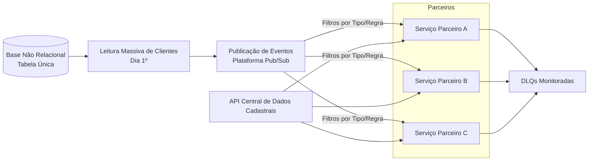

**Titulo**: Sistema de Assinatura de Pacotes de Benefícios Orientado a Eventos
**Nivel**: Avançado
**Temas**: Arquitetura orientada a eventos, processamento em larga escala, assinaturas mensais, integração com múltiplos parceiros, pub/sub, gargalos de throughput, DLQs, caos operacional em picos mensais.
**Resumo do Problema:** 
* O sistema comercializa pacotes de benefícios fornecidos por parceiros externos e realiza a renovação mensal das assinaturas de milhões de clientes. O processamento ocorre em massa no início de cada ciclo, quando todos os clientes são lidos de um banco de dados não relacional estruturado em tabela única. Cada cliente gera um evento publicado em uma plataforma de mensageria, consumido por múltiplos serviços especializados que aplicam lógicas distintas de acordo com o parceiro e o tipo de operação (renovação, contratação, suspensão, cancelamento).
* A arquitetura atual apresenta limitações críticas: o processamento mensal é lento e pode levar vários dias; 
* Cada novo parceiro exige infraestrutura e regras específicas, aumentando a complexidade; a API central de dados cadastrais sofre saturação em picos e causa falhas distribuídas; o modelo de tabela única gera inconsistências e dependências de ordem; e as DLQs acumulam grande volume, dificultando a recuperação. 
* O objetivo é manter o modelo atual, porém garantir escalabilidade, resiliência, previsibilidade de latência e facilidade de integrar novos parceiros sem afetar a operação principal.

# Requisitos Funcionais
* O sistema deve renovar automaticamente as assinaturas no início de cada ciclo, processando milhões de clientes em curto intervalo com estabilidade. Deve garantir a continuidade do serviço de assinatura, permitindo operações como contratação, suspensão e cancelamento via eventos.
* Deve oferecer capacidade de integração ágil com novos parceiros, suportando regras específicas sem necessidade de grandes reestruturações de infraestrutura. A arquitetura deve manter o fluxo orientado a eventos, permitindo que cada serviço processe apenas os eventos relevantes.
* A API de dados cadastrais deve fornecer informações consistentes para os serviços dependentes, especialmente os responsáveis por cobrança, gestão de assinaturas e vendas.

## Requisitos Não Funcionais
* O sistema deve suportar escalabilidade horizontal para absorver milhões de eventos em picos mensais, mantendo latência previsível e evitando bloqueios em cascata. 
* A API central deve operar com alta disponibilidade, com estratégias de mitigação de sobrecarga. 
* O processamento deve tolerar falhas, como eventos inválidos ou inconsistentes, com DLQs monitoráveis, limitadas e com fluxo de tratamento eficiente.
* A segurança das integrações e do tráfego entre serviços deve ser garantida com protocolos adequados, além de auditoria para rastrear eventos críticos. 
* O desempenho deve permitir o término do processamento mensal em prazo reduzido e previsível, mitigando gargalos causados por dependências de ordem no modelo de dados.
* Monitoramento, rastreabilidade de eventos, métricas de throughput, comportamento de filas e mecanismos de retry controlado são essenciais para visibilidade e operação estável.

## Diagrama Mermaid 

## Extensões / Perguntas de Reflexão (Opcional)
* O ciclo de renovação poderia ser distribuído ao longo de mais dias, preservando regras de cobrança?
* Como desacoplar consultas cadastrais do pico mensal sem duplicar dados sensíveis?
* Quais estratégias poderiam reduzir dependência do modelo de tabela única sem quebrar restrições de negócio?
* Seria possível introduzir circuit breakers ou rate limits na API central para evitar cascatas de falhas?