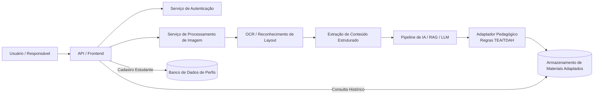

**Titulo**: Adaptação de material escolar Publico TEA e TDAH.

**Nivel:**  Avançado

**Temas:** Processamento de imagem, personalização de conteúdo educacional, acessibilidade cognitiva, RAG/LLM, pipelines assíncronos, adaptação de material didático.

**Resumo do Problema:**

* O sistema precisa receber imagens de materiais escolares — como páginas de apostilas, exercícios ou textos — processar essas imagens, extrair conteúdo relevante e gerar uma versão adaptada para estudantes com necessidades específicas relacionadas a condições neurodiversas, como TEA e TDAH. 
* A adaptação deve considerar diretrizes educacionais, fontes externas confiáveis e modelos de linguagem capazes de transformar e reorganizar o conteúdo original em versões mais acessíveis, mantendo fidelidade sem afetar o aprendizado. 
* O usuário deve poder autenticar-se, cadastrar o estudante e enviar as imagens para processamento, recebendo materiais adaptados de forma segura, organizada e consistente.

## Requisitos Funcionais

* O sistema deve permitir autenticação segura e registro de perfis de estudantes, incluindo preferências ou parâmetros pedagógicos necessários para personalização. Deve receber imagens enviadas pelo usuário, realizar extração e interpretação de conteúdo (via OCR, vetorização ou reconhecimento de layout), e encaminhar esse conteúdo para um pipeline de IA capaz de aplicar técnicas de adaptação cognitiva.
* A resposta deve incluir um material reestruturado ou redesenhado, mantendo elementos essenciais como textos, diagramas e instruções, porém adaptados para melhor compreensão por estudantes com perfis neurodiversos. Todo material processado deve ficar acessível em um histórico seguro, permitindo revisualização.
* O sistema deve integrar fontes externas — como diretrizes pedagógicas e bases de conhecimento relevantes — por meio de técnicas de RAG ou consultas a modelos de linguagem. Por fim, deve possibilitar que o responsável visualize histórico de processamento e exporte o material adaptado para uso offline.

## Requisitos Não-Funcionais

* A segurança deve garantir proteção de dados sensíveis, especialmente por envolver informações de crianças e adolescentes, exigindo criptografia, controle rigoroso de acesso e auditoria. O sistema deve ser escalável, suportando períodos de grande volume de uploads e processamento pesado por parte dos serviços de OCR e IA.
* A latência deve ser razoável considerando a complexidade do processamento — ainda que não necessariamente real-time — e o custo operacional de modelos de ML deve ser monitorado e otimizado. O sistema deve assegurar precisão e consistência na adaptação, evitando distorções semânticas e garantindo que o material final esteja alinhado às referências pedagógicas utilizadas.
* Disponibilidade, monitoramento, rastreabilidade do pipeline de adaptação e isolamento adequado entre componentes também são desejáveis

## Diagrama Conceitual 

## Extensões / Perguntas de Reflexão (Opcional)

* Como validar pedagogicamente que a adaptação realmente melhora acessibilidade cognitiva?
* Quais métricas podem ser usadas para detectar distorção indesejada causada por LLMs?
* O sistema deve permitir parametrização por grau de suporte (por exemplo: simplificação leve, moderada ou profunda)?
* Como garantir explainability nas adaptações aplicadas pelo modelo?