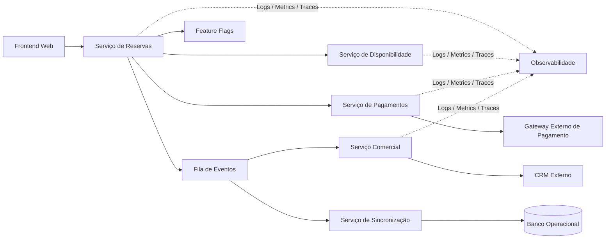

## Titulo: Fluxo Distribuído de Reserva Online com Controle de Disponibilidade Concorrente

**Nivel:** AVANCADO  
**Temas:** Sistemas Distribuídos, Event-Driven Architecture, Consistência Eventual, Controle de Concorrência, Saga Pattern, Integração com Sistemas Externos, Feature Flags, Idempotência, Resiliência, Booking Systems

## Resumo do Problema:

Uma plataforma digital de reservas deseja evoluir seu fluxo operacional atual, baseado em pré-reservas assistidas, para um modelo de confirmação online direta, permitindo que determinados usuários finalizem reservas sem intervenção humana inicial.

A arquitetura existente é composta por múltiplos domínios independentes responsáveis por disponibilidade de recursos, cadastro de clientes, gestão comercial e processamento financeiro. A comunicação entre os serviços ocorre majoritariamente de forma assíncrona através de eventos distribuídos.

No novo fluxo, o usuário deve selecionar um recurso disponível, efetuar o pagamento e gerar automaticamente um registro comercial integrado a uma plataforma externa de relacionamento e gestão comercial.

O principal desafio técnico está na garantia de consistência da disponibilidade em cenários concorrentes de alta demanda, evitando conflitos de reserva simultânea. Além disso, o sistema precisa lidar com falhas parciais entre serviços distribuídos, sincronização eventual de estados e atualização assíncrona das informações após confirmação financeira.

A solução deve permitir rollout gradual da funcionalidade para grupos específicos de usuários, coexistindo com o fluxo operacional atual sem regressões.

---

## Requisitos Funcionais

- Permitir criação de reservas diretamente pela plataforma web.
- Consultar disponibilidade de recursos em tempo real.
- Validar disponibilidade antes da confirmação da reserva.
- Integrar o fluxo com um provedor externo de pagamentos.
- Criar automaticamente um registro comercial associado à reserva.
- Sincronizar dados entre plataforma operacional e sistemas externos.
- Permitir atualização posterior de informações da reserva.
- Manter comunicação assíncrona baseada em eventos entre domínios.
- Permitir rollout gradual da funcionalidade através de feature flags.
- Continuar suportando o fluxo legado de pré-reserva.
- Registrar status intermediários do fluxo distribuído.
- Possibilitar reprocessamento de eventos com falha.

---

## Requisitos Não Funcionais

- Garantir consistência da disponibilidade em cenários concorrentes.
- Evitar overbooking em acessos simultâneos.
- Garantir idempotência em operações críticas.
- Suportar comunicação distribuída orientada a eventos.
- Garantir consistência eventual entre os domínios.
- Tempo médio de resposta inferior a 300 ms nas operações síncronas.
- Alta disponibilidade do fluxo de reservas (SLA ≥ 99,9%).
- Escalabilidade horizontal dos serviços críticos.
- Tolerância a falhas em integrações externas.
- Implementar retries e Dead Letter Queues para falhas permanentes.
- Garantir rastreabilidade ponta a ponta via correlation IDs.
- Possibilitar rollback funcional através de feature flags.
- Minimizar acoplamento entre domínios internos e integrações externas.
- Garantir observabilidade distribuída com métricas, logs e tracing.
- Garantir comunicação segura entre serviços e parceiros externos.

---

## Detalhes e Pistas de Implementação

- Avaliar mecanismos de lock otimista ou pessimista para controle de disponibilidade.
- Considerar utilização de reservas temporárias ("soft lock") com expiração automática.
- Implementar Saga Pattern para coordenação do fluxo distribuído.
- Utilizar Outbox Pattern para garantir publicação confiável de eventos.
- Garantir idempotência utilizando request IDs ou operation IDs.
- Implementar retries exponenciais com jitter para integrações externas.
- Separar eventos de domínio de eventos de integração.
- Avaliar estratégias de compensação para falhas após pagamento aprovado.
- Considerar uso de cache distribuído para consultas de disponibilidade.
- Implementar feature flags por grupo de usuários ou percentual de tráfego.
- Avaliar impactos de ordenação de eventos em cenários distribuídos.
- Implementar mecanismos de reconciliação entre sistemas internos e externos.
- Utilizar tracing distribuído para identificar gargalos no fluxo.
- Implementar auditoria de alterações de estado da reserva.
- Avaliar impacto de consistência eventual na experiência do usuário.

---

## Extensões / Perguntas de Reflexão (Opcional)

- Como evitar overbooking em cenários de alta concorrência distribuída?
- Qual abordagem seria mais adequada: lock pessimista, lock otimista ou reservas temporárias?
- Como lidar com pagamento aprovado após perda da disponibilidade?
- Como implementar compensações em falhas parciais do fluxo?
- Como evitar duplicidade de reservas durante retries?
- Como garantir consistência eventual entre reserva, pagamento e CRM?
- O fluxo deveria utilizar orquestração centralizada ou coreografia baseada em eventos?
- Como minimizar impacto de indisponibilidade do sistema externo comercial?
- Como medir corretamente disponibilidade real do fluxo distribuído?
- Como estruturar rollout gradual sem afetar usuários do fluxo legado?
- Como implementar reconciliação automática entre estados inconsistentes?

---

## Diagrama Conceitual (Mermaid)

