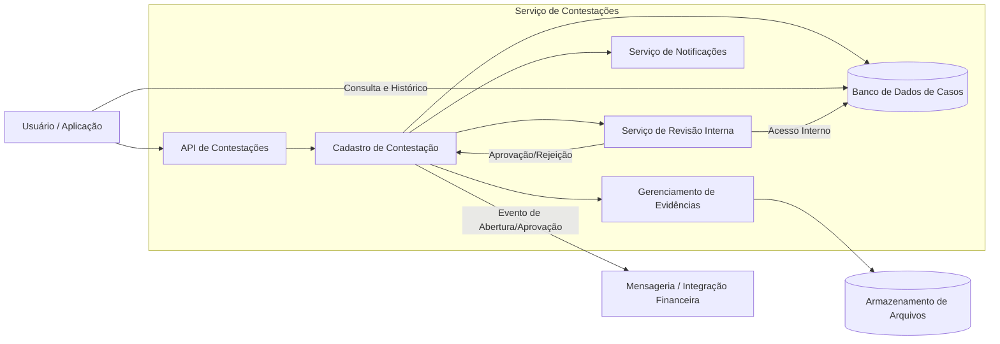

**Nivel:** Intermediário / Avançado

**Temas:** Sistemas transacionais, disputa de compras, fluxo assíncrono, anexos, mensageria, consistência, escalabilidade em períodos de pico.

**Resumo do Problema:**
O sistema precisa permitir que usuários iniciem e acompanhem contestações de compras realizadas em meios de pagamento digitais. O fluxo envolve abertura de disputa, anexação de evidências, atualização de status, análise por uma equipe interna e eventual processamento automatizado de reembolso. Em períodos de grande volume, o sistema deve absorver aumentos abruptos de carga sem perda de disponibilidade. A solução deve integrar-se a serviços externos de transações financeiras e manter padrões rígidos de segurança, privacidade e retenção de dados.

## Requisitos Funcionais
* O sistema deve possibilitar que um usuário abra uma contestação para transações elegíveis, registrando detalhes da transação, motivo e metadados essenciais. Deve permitir anexar arquivos de evidência e gerenciar múltiplas versões ou documentos associados ao caso. O usuário deve consultar seu histórico de contestações com visão detalhada do status, datas de atualização e ações pendentes.
* Atualizações de status (como recebida, em análise, aprovada ou negada) devem gerar notificações ao usuário por meio de canais configuráveis. Uma interface interna deve permitir que uma equipe de análise visualize todos os detalhes da contestação, incluindo evidências, e aprove ou rejeite o caso.
* Quando uma contestação for aprovada, o sistema deve iniciar automaticamente a solicitação de reembolso via integração com um serviço financeiro externo, utilizando APIs ou mensageria assíncrona. O processo deve registrar logs auditáveis de todas as ações e transições de estado para fins de conformidade e rastreabilidade.

## Requisitos Não Funcionais
* O sistema deve garantir alta disponibilidade, mantendo SLA de 99,9% para rotas críticas como abertura e consulta de contestações. Deve escalar horizontalmente para suportar picos de até cinco vezes o volume normal de requisições, especialmente em períodos de grande volume de transações contestadas.
* A latência média do endpoint de abertura de contestação deve permanecer abaixo de 200 ms, mesmo sob carga significativa. Dados sensíveis, como detalhes da transação e informações pessoais, devem ser criptografados em trânsito e em repouso. Logs devem ser anonimizados ou mascarados para evitar exposição de dados confidenciais.
* O sistema deve manter isolamento entre serviços, evitar sobrecarga em componentes internos e garantir tolerância a falhas, especialmente na integração com serviços financeiros externos. Métricas, rastreamento distribuído e alarmes devem estar presentes para monitoramento contínuo do fluxo de contestações.

## Extensões / Perguntas de Reflexão (Opcional)
* Como lidar com contestações duplicadas para a mesma transação?
* Qual estratégia de mensageria garantiria maior resiliência no processo de reembolso?
* Como modelar o versionamento das evidências de forma eficiente e segura?
* Como validar evidências de forma automatizada para reduzir a carga da equipe interna?