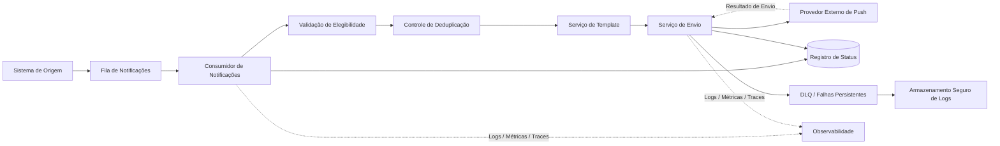

## Titulo:
Pipeline Distribuído de Envio de Notificações Móveis

**Nivel:** INTERMEDIARIO  
**Temas:** Mensageria, Processamento Assíncrono, Push Notifications, Idempotência, Deduplicação, Alta Disponibilidade, Rate Limiting, Observabilidade, Retenção de Logs

## Resumo do Problema:

Um sistema precisa orquestrar o envio de notificações móveis a partir de eventos recebidos de sistemas de origem. O fluxo é composto por serviços independentes: um responsável por consumir mensagens de uma fila e validar a elegibilidade do usuário, e outro responsável por montar o conteúdo da mensagem e realizar o disparo através de um provedor externo de notificações.

O principal desafio está em garantir que cada usuário receba no máximo uma notificação dentro de uma janela de tempo definida, evitando duplicidade mesmo em cenários de retry, falhas parciais ou reprocessamento de mensagens.

Além disso, o sistema deve suportar picos elevados de envio durante campanhas, manter baixa latência de processamento após o recebimento dos eventos e preservar logs de falha de maneira segura para auditoria e análise operacional.

---

## Requisitos Funcionais

- Consumir eventos de notificação a partir de uma fila de mensageria.
- Validar a elegibilidade do usuário antes do envio.
- Montar dinamicamente o template da mensagem.
- Enviar a notificação para um provedor externo de push.
- Garantir que usuários não recebam notificações duplicadas dentro da janela definida.
- Registrar tentativas de envio, sucesso e falha.
- Permitir reprocessamento controlado de notificações com falha.
- Armazenar logs de falhas para análise posterior.
- Expor métricas operacionais sobre volume, sucesso, falha e latência.

---

## Requisitos Não Funcionais

- Processar e disparar notificações em até 500 ms após o recebimento do evento.
- Suportar picos de até 10.000 notificações por segundo.
- Garantir disponibilidade mensal mínima de 99,9%.
- Garantir idempotência no consumo e envio das notificações.
- Evitar duplicidade de envio em cenários de retry ou falha parcial.
- Implementar controle de deduplicação por usuário e janela temporal.
- Garantir tolerância a falhas no provedor externo.
- Implementar retries com backoff e Dead Letter Queue para falhas persistentes.
- Reter logs de falha por no mínimo 30 dias.
- Proteger dados sensíveis em logs, payloads e integrações.
- Permitir escalabilidade horizontal dos consumidores.
- Garantir observabilidade com logs estruturados, métricas e tracing distribuído.

---

## Detalhes e Pistas de Implementação

- Utilizar uma chave de idempotência composta por usuário, campanha, tipo de notificação e janela temporal.
- Implementar deduplicação em armazenamento de baixa latência, como cache distribuído ou banco chave-valor.
- Utilizar TTL para controlar a janela de uma hora sem duplicidade.
- Separar a validação de elegibilidade da etapa de envio.
- Controlar concorrência entre múltiplos consumidores da fila.
- Implementar rate limiting para respeitar limites do provedor externo.
- Usar batch processing apenas se não comprometer a latência de 500 ms.
- Registrar estados como recebido, elegível, enviado, falhou e descartado por duplicidade.
- Implementar DLQ para eventos inválidos ou falhas permanentes.
- Utilizar circuit breaker para falhas recorrentes no provedor externo.
- Persistir logs de falha em armazenamento seguro com retenção mínima de 30 dias.
- Monitorar métricas como throughput, latência p95/p99, taxa de erro e backlog da fila.
- Definir alertas para aumento de falhas, atraso no consumo e saturação dos workers.

---

## Extensões / Perguntas de Reflexão (Opcional)

- Como garantir deduplicação em múltiplos consumidores concorrentes?
- A deduplicação deve ocorrer antes ou depois da validação de elegibilidade?
- Como lidar com falhas após o provedor externo receber a requisição, mas antes do sistema registrar sucesso?
- O sistema deve priorizar baixa latência ou maior garantia de entrega?
- Como proteger o provedor externo durante campanhas com picos de tráfego?
- Como modelar retry sem violar a regra de no máximo uma notificação por usuário?
- Como diferenciar falhas transitórias de falhas permanentes?
- Como projetar a solução para suportar múltiplos canais no futuro?
- Quais métricas indicam degradação antes de uma falha completa?
- Como auditar notificações descartadas por deduplicação?

---

## Diagrama Conceitual (Mermaid)

