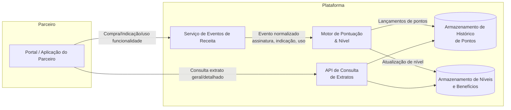

**Nivel:** Intermediário / Avançado
**Temas:** Programa de parceria, motor de pontuação, MRR, cálculo baseado em receita, extrato de pontos, janela móvel de 30 dias, atualização quase em tempo real.
**Resumo do Problema:** Um programa de parceria precisa de um motor de pontuação e definição de nível em que cada parceiro acumula pontos proporcionalmente à receita recorrente mensal que ajuda a gerar para a plataforma. Essa receita pode vir tanto de compras diretas de assinaturas quanto de indicações de novos clientes e de uso de determinadas funcionalidades cujo faturamento é transacional. A pontuação é usada para determinar o nível atual do parceiro e habilitar benefícios, como descontos progressivos em produtos e serviços, exigindo atualizações rápidas e consultas detalhadas de extratos de pontos.

## Requisitos Funcionais
O sistema deve calcular a pontuação do parceiro com base em diferentes tipos de eventos de receita. Para assinaturas recorrentes, quando um parceiro adquire ou indica uma assinatura com valor mensal, a quantidade de pontos equivale ao valor mensal recorrente. Em assinaturas com cobrança anual, o valor anual deve ser convertido em equivalente mensal antes de gerar pontos (por exemplo, valor anual dividido por doze e esse resultado convertido em pontos). 

Para funcionalidades transacionais, o sistema deve considerar o volume de uso e um valor de receita por transação, gerando pontos proporcionais à receita recorrente do período.
A cada evento elegível (compra de assinatura, indicação de assinatura, uso de funcionalidade transacional), o sistema deve atualizar a pontuação e o nível do parceiro, respeitando a regra de que a pontuação atual corresponde à maior pontuação consolidada nos últimos trinta dias. Isso implica a necessidade de manter um histórico de pontos por dia ou por evento que permita reprocessar a pontuação dentro dessa janela móvel.

O parceiro deve conseguir consultar um extrato geral de pontos, com visão agregada por período, destacando saldo atual, pontuação máxima considerada na janela de trinta dias e, eventualmente, total de pontos gerados por tipo de origem (assinaturas diretas, indicações de assinaturas, uso de funcionalidades). Além disso, deve existir um extrato detalhado em que cada evento de geração de pontos possa ser consultado com data, tipo de evento, valor de receita associado, cálculo de pontos aplicado e status do lançamento (por exemplo, confirmado, em processamento, expirado).

O sistema deve manter a relação entre pontuação e níveis de parceria, com faixas de pontos que definem o nível atual do parceiro e os benefícios correspondentes. Sempre que a pontuação máxima dos últimos trinta dias cruzar uma faixa de nível (para cima ou para baixo), o sistema deve atualizar o nível do parceiro e registrar essa transição para fins de auditoria e experiência do usuário.

## Requisitos Não Funcionais

A atualização da pontuação e do nível do parceiro deve ocorrer em tempo próximo ao real, com tempo de resposta inferior a cinco segundos após a ocorrência do evento de receita, pois essa atualização é gatilho para aplicação automática de benefícios como descontos em produtos e serviços dentro da plataforma. 

O sistema deve ser escalável para lidar com um grande volume de eventos de receita, tanto em cenários de alta quantidade de transações por parceiro quanto em cenários com muitos parceiros simultâneos, mantendo baixa latência de gravação e consulta.

Do ponto de vista de consistência, o cálculo de pontuação e a determinação do nível devem evitar condições de corrida, garantindo que múltiplos eventos simultâneos para o mesmo parceiro não resultem em pontuações incorretas. 

A solução deve oferecer mecanismos de reprocessamento ou recomputação da pontuação em janelas passadas, caso haja correções de dados de faturamento. Em termos de segurança, dados de faturamento e informações de parceiros devem ser protegidos com controles de acesso, criptografia em trânsito e em repouso, além de trilhas de auditoria para alterações relevantes, como ajustes manuais de pontuação.

A alta disponibilidade é desejável, com o sistema de pontuação projetado para continuar operando mesmo em caso de falhas parciais de componentes de armazenamento ou processamento. Logs, métricas e rastreamentos devem estar disponíveis para monitorar taxas de eventos, tempos de processamento, erros de cálculo e latência de consulta dos extratos.

## Diagrama Conceitual

## Extensões / Perguntas de Reflexão (Opcional)

Como o sistema deve lidar com estornos, cancelamentos de assinaturas ou ajustes de faturamento retroativos e seu impacto na pontuação e no nível do parceiro, especialmente considerando a janela de trinta dias? De que forma diferentes modelos de consistência (forte versus eventual) impactam a experiência do parceiro na atualização do nível e na aplicação imediata de benefícios atrelados à pontuação? Como projetar o esquema de dados para permitir reprocessamentos de grandes volumes históricos de eventos de receita sem comprometer a operação online do sistema de pontuação?