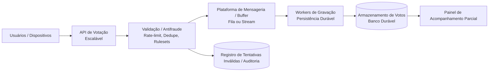

**Titulo**: VotaAí - Sistema de Votação Escalável para Reality Shows (Baseado Desafio da Globo)

**Nivel:**  Intermediário

**Temas:** Alta escala, votação em tempo real, antifraude, baixa latência, durabilidade forte, picos extremos, sistemas distribuídos, observabilidade e resiliência.

**Resumo do Problema:** 
* O sistema VotaAí oferece votação online em larga escala para programas de entretenimento ao vivo, nos quais o público decide resultados por meio de votos digitais. 
* Durante picos extremos — especialmente nos momentos de eliminação — o sistema deve ser capaz de absorver centenas de milhões de votos com baixa latência, alta disponibilidade e sem risco de perda de dados. 
* A solução envolve APIs altamente escaláveis, mecanismos de validação e antifraude, armazenamento durável, observabilidade completa e auditoria. 
* O desafio principal é garantir integridade do resultado sob carga massiva, mantendo um fluxo confiável do recebimento do voto até seu registro definitivo, mesmo diante de tentativas de abuso, bots ou ataques de negação de serviço.

## Requisitos Funcionais
* O sistema deve disponibilizar uma API capaz de receber votos em tempo real e processá-los com latência inferior a 300 ms. 
* A solução deve validar votos de acordo com as regras estabelecidas para o evento, como limitação por CPF, IP ou sessão — assegurando que apenas votos elegíveis sejam computados.
* Cada voto válido deve ser registrado de forma durável, com garantia de integridade e sem possibilidade de reversão. 
* O sistema deve disponibilizar um painel para visualização parcial da votação, sem interferir no fluxo principal ou revelar resultados finais prematuramente.
* Tentativas de fraude, abuso ou padrões suspeitos devem ser identificadas e auditadas, com capacidade de registrar tentativas inválidas para posterior investigação. 
* Regras de antifraude devem ser aplicadas de forma rápida e eficiente para não impactar o throughput.

## Requisitos Não Funcionais
* A arquitetura deve garantir escalabilidade horizontal para suportar picos de dezenas de milhares de votos por segundo, sem queda de performance. 
* A disponibilidade deve se manter acima de 99,99% durante o evento, e o sistema deve tolerar falhas com mecanismos como retries, fallback e isolamento de componentes críticos.
* A segurança deve contemplar mitigação de bots, verificação de duplicidade e proteção contra ataques DDoS. A durabilidade deve seguir padrões ACID, garantindo que nenhum voto válido seja perdido ou corrompido.
* A solução deve apresentar observabilidade completa — logs estruturados, métricas de throughput, latência, erros, anomalias, além de rastreamento distribuído para identificar gargalos em tempo real.
* Deve haver foco em soluções open source

## Diagrama Conceitual (Mermaid)

## Extensões / Perguntas de Reflexão (Opcional)
* Como garantir que a camada de antifraude não se torne o gargalo de ingestão?
* Que modelo de armazenamento garantiria maior throughput de escrita: logs imutáveis, timeseries, key-value distribuído ou banco relacional tunado?
* Como provar auditoria e integridade criptográfica dos votos em caso de questionamentos públicos?
* Seria possível usar técnicas probabilísticas para estimar duplicidade sem comprometer durabilidade?